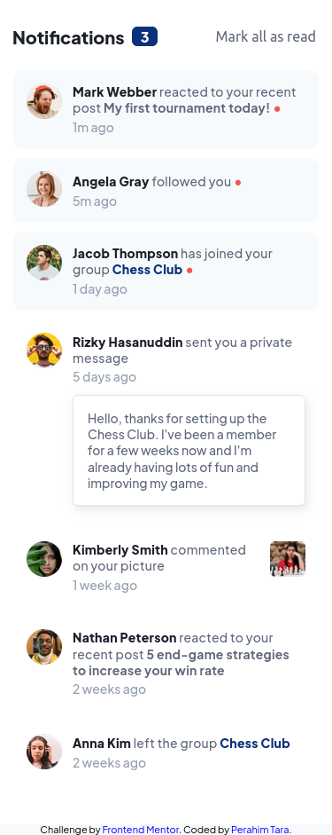

# Frontend Mentor - Notifications page solution

This is a solution to the [Notifications page challenge on Frontend Mentor](https://www.frontendmentor.io/challenges/notifications-page-DqK5QAmKbC). Frontend Mentor challenges help you improve your coding skills by building realistic projects. 

## Overview

### The challenge

Users should be able to:

- Distinguish between "unread" and "read" notifications
- Select "Mark all as read" to toggle the visual state of the unread notifications and set the number of unread messages to zero
- View the optimal layout for the interface depending on their device's screen size
- See hover and focus states for all interactive elements on the page

### Screenshot

- Desktop Preview

- Mobile Preview

### Links

- Solution URL: [Solution](https://github.com/TaraDesk/code-in-practice-jr/tree/main/notifications-page-main)
- Live Site URL: [Github Pages](https://taradesk.github.io/code-in-practice-jr/notifications-page-main/index.html)

## My process

### Built with

- Semantic HTML5 markup
- Sass (Syntactically Awesome Stylesheets)
- Flexbox
- Mobile-first workflow

## Author

- Website - [Perahim Tara](https://www.your-site.com)
- Frontend Mentor - [@TaraDesk](https://www.frontendmentor.io/profile/TaraDesk)
- Twitter - [@yourusername](https://www.twitter.com/yourusername)